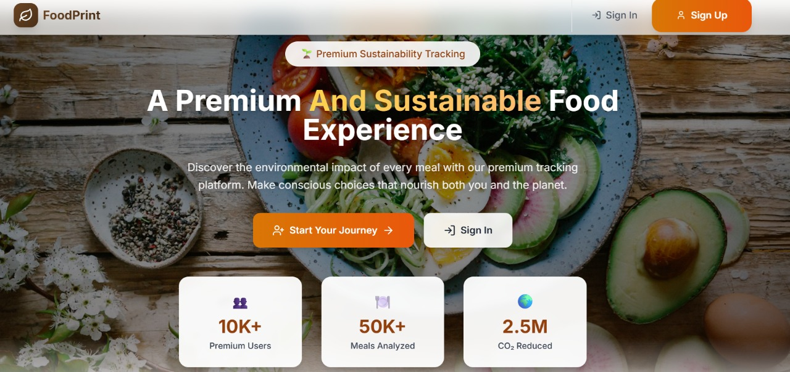

# 🌱 FoodPrint - Track Your Food's Environmental Impact
**Preview**
foodprint-five.vercel.app  

## 📋 Overview

FoodPrint is a modern, interactive web application designed to help users track and understand the environmental impact of their food choices. By providing detailed metrics on carbon footprint, water usage, and land use for various food items, FoodPrint empowers users to make more sustainable and eco-friendly dietary decisions.

[](https://foodprint-five.vercel.app)
## 🌍 Why FoodPrint?

Food production is responsible for approximately 26% of global greenhouse gas emissions. By making informed choices about what we eat, we can significantly reduce our individual environmental footprint. FoodPrint makes this possible by:

- **Visualizing impact**: Converting complex environmental data into easy-to-understand metrics
- **Tracking progress**: Allowing users to monitor their environmental impact over time
- **Building awareness**: Educating users about the relationship between food choices and sustainability
- **Encouraging change**: Providing alternatives and recommendations for more eco-friendly options

## ✨ Core Features

### 🍽️ Meal Tracking
- Log daily meals with detailed environmental metrics
- View comprehensive breakdown of each meal's impact
- Track historical data and analyze trends over time
- Categorize meals (breakfast, lunch, dinner, snacks)

### 🤖 AI Recipe Generator
- Create custom, environmentally-friendly recipes from selected ingredients
- Get real-time CO₂ and water usage calculations for each recipe
- Receive AI-powered health scores (0-100) for all generated recipes
- Follow step-by-step cooking instructions with timing and serving information

### 📊 Environmental Dashboard
- View personalized environmental impact metrics
- Track progress with interactive charts and visualizations
- Set goals and monitor improvements over time
- Compare your impact against regional and global averages

### 🏆 Sustainability Challenges
- Join community challenges to reduce environmental footprint
- Compete on leaderboards with other environmentally-conscious users
- Earn badges and achievements for meeting sustainability goals
- Share accomplishments on social media platforms

### ⚠️ Health Risk Analysis
- Receive instant health risk assessments for food items
- View color-coded risk levels (Low, Medium, High)
- Get detailed warnings about potential health concerns
- Discover healthier alternatives to high-risk foods

### 🔍 Comprehensive Food Database
- Access detailed nutritional information (calories, protein, fat, carbs)
- View environmental metrics (carbon footprint, water usage, land use)
- Search and filter foods by various criteria
- Add custom food items to the database

---

## 🚀 Getting Started

### Prerequisites
- **Node.js**: Version 18.0.0 or higher
- **npm/yarn**: For package management
- **Firebase Account**: For authentication and database services
- **Git**: For version control

### Installation

1. **Clone the repository**
   ```bash
   git clone https://github.com/Sunayana225/Foodprint.git
   cd foodprint-app
   ```

2. **Install dependencies**
   ```bash
   npm install
   # or
   yarn install
   ```

3. **Configure environment variables**
   Create a `.env` file in the root directory with your Firebase configuration:
   ```env
   VITE_FIREBASE_API_KEY=your_api_key_here
   VITE_FIREBASE_AUTH_DOMAIN=your_project.firebaseapp.com
   VITE_FIREBASE_PROJECT_ID=your_project_id
   VITE_FIREBASE_STORAGE_BUCKET=your_project.appspot.com
   VITE_FIREBASE_MESSAGING_SENDER_ID=your_sender_id
   VITE_FIREBASE_APP_ID=your_app_id
   VITE_FIREBASE_MEASUREMENT_ID=your_measurement_id
   ```

4. **Set up Firebase**
   - Create a new project in the [Firebase Console](https://console.firebase.google.com/)
   - Enable Authentication (Email/Password and Google Sign-In)
   - Set up Firestore Database with the security rules provided in `firestore.rules`
   - Update your `.env` file with the Firebase configuration details

5. **Start the development server**
   ```bash
   npm run dev
   # or
   yarn dev
   ```
   The application will be available at `http://localhost:5173`

### Building for Production

```bash
# Standard production build
npm run build

# Optimized build with performance analysis
npm run build:analyze

# Fast build for quick testing
npm run build:fast
```

### Deployment Options

#### Firebase Hosting (Recommended)
```bash
# Deploy the entire application
npm run firebase:deploy

# Deploy only Firestore security rules
npm run firebase:rules
```

#### Vercel Deployment
1. Push your code to GitHub
2. Connect your repository to [Vercel](https://vercel.com)
3. Configure the environment variables in Vercel dashboard
4. Deploy using the settings in `vercel.json`

See [VERCEL_DEPLOYMENT.md](./VERCEL_DEPLOYMENT.md) for detailed instructions.

## 🔧 Technical Architecture

### Tech Stack
- **Frontend**: React with TypeScript
- **State Management**: React Context API
- **Styling**: Tailwind CSS with custom components
- **Build Tool**: Vite
- **Backend**: Firebase (Authentication, Firestore, Hosting)
- **Performance Monitoring**: Custom performance monitoring system
- **External APIs**: USDA Food Database, Open Food Facts

### Project Structure
```
src/
├── assets/        # Static assets (images, icons)
├── components/    # Reusable UI components
├── config/        # Configuration files (Firebase, etc.)
├── contexts/      # React contexts for state management
├── data/          # Local data and mock datasets
├── hooks/         # Custom React hooks
├── pages/         # Page components and routes
├── services/      # API services and business logic
├── types/         # TypeScript type definitions
└── utils/         # Utility functions and helpers
```

### Key Technologies
- **React**: Component-based UI architecture
- **TypeScript**: Type safety and improved developer experience
- **Firebase**: Authentication, Firestore database, hosting
- **Tailwind CSS**: Utility-first CSS framework for styling
- **Vite**: Next-generation frontend tooling
- **Framer Motion**: Animations and transitions
- **Chart.js**: Data visualization for impact metrics
- **Axios**: API request handling

## � Features in Development

- **Food Image Recognition**: Upload photos to identify and log food items
- **Mobile App**: React Native versions for iOS and Android
- **Meal Planning**: AI-powered weekly meal planner with shopping lists
- **Social Sharing**: Share achievements and recipes with friends
- **Carbon Offset Integration**: Purchase carbon offsets based on food impact
- **Advanced Analytics**: Enhanced data visualization and insights
- **Community Forums**: Connect with like-minded sustainable eaters

## 🤝 Contributing

We welcome contributions from the community! To contribute:

1. Fork the repository
2. Create a feature branch: `git checkout -b feature/amazing-feature`
3. Commit your changes: `git commit -m 'Add some amazing feature'`
4. Push to the branch: `git push origin feature/amazing-feature`
5. Open a Pull Request

Please see our [Contributing Guide](./CONTRIBUTING.md) for more details.

## 📜 License

This project is licensed under the MIT License - see the LICENSE file for details.

## 📧 Contact

- Project Link: [https://github.com/Sunayana225/Foodprint](https://github.com/Sunayana225/Foodprint)
- Website: [https://foodprint-five.vercel.app](https://foodprint-five.vercel.app)

---

**FoodPrint - Making sustainable eating both accessible and impactful! 🌱🌍**
